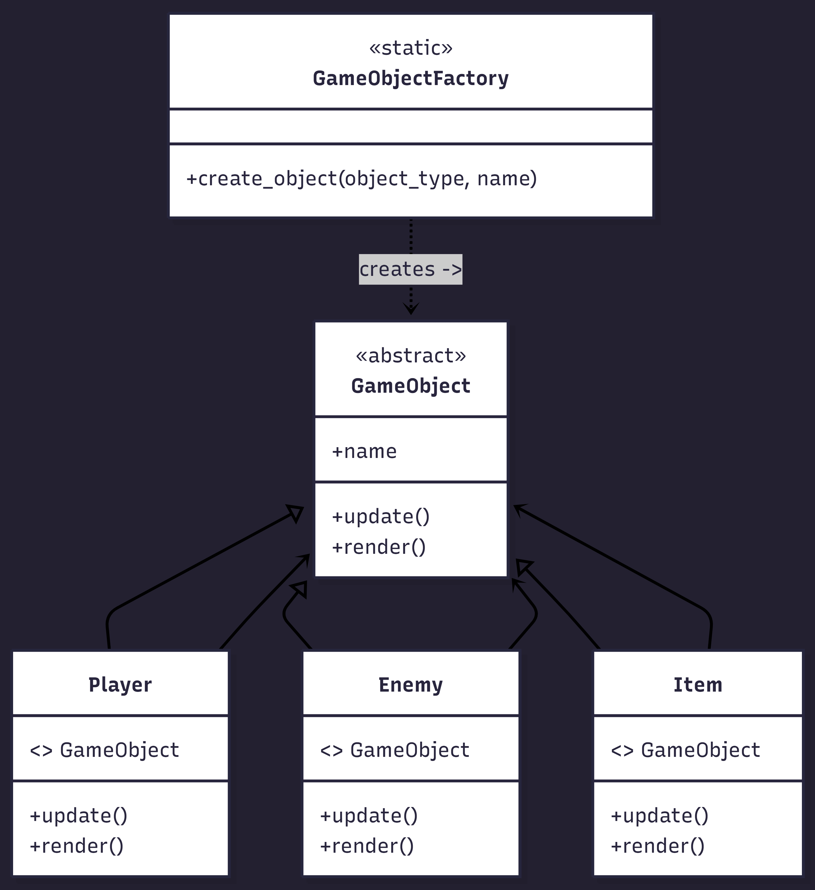
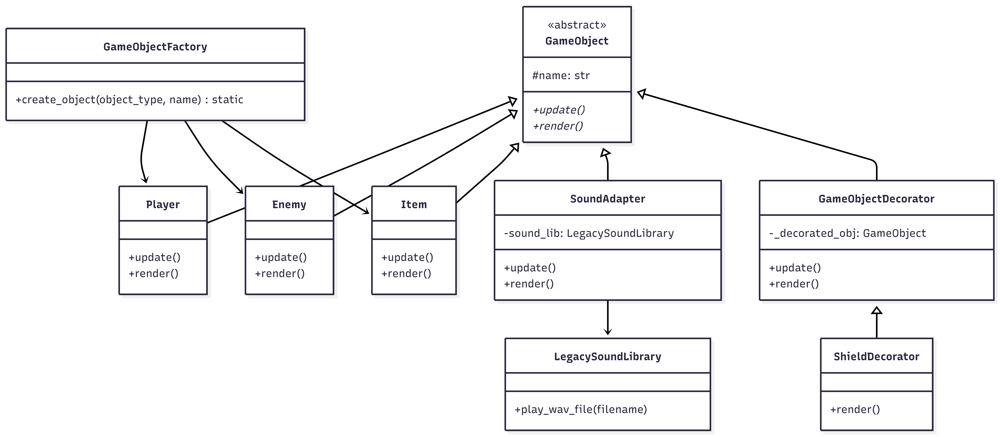
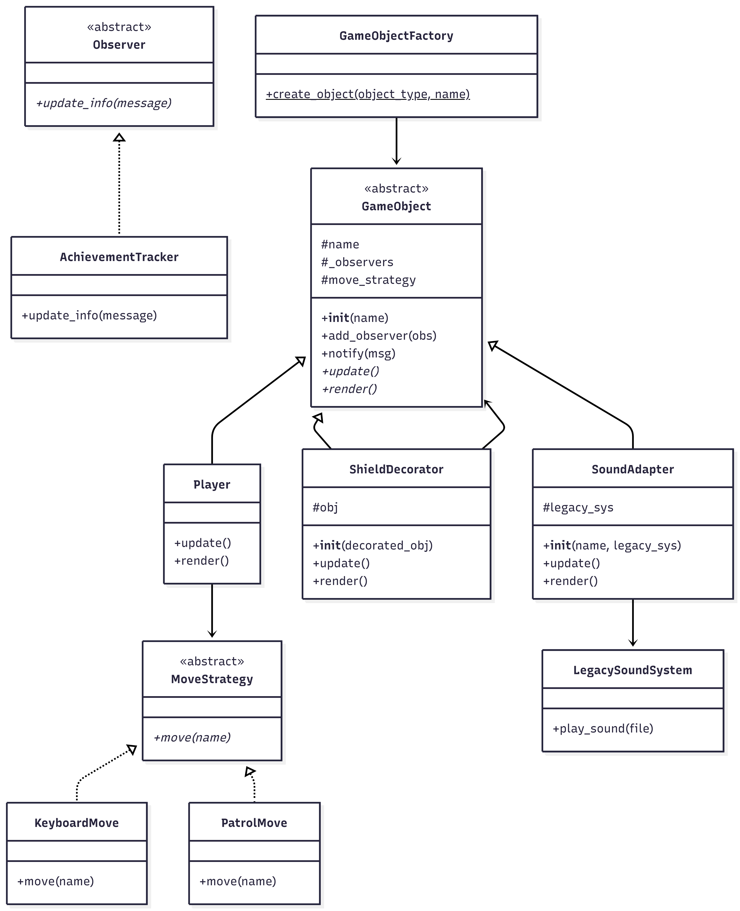

Konu: Mini Oyun Motoru
Oyun motoru senaryosu, farklı nesne tiplerinin davranışlarını yönetmek için tasarım örüntülerinin nasıl kullanıldığını görmek açısından çok zengin bir alan sunuyor. if-else karmaşasından kurtulup daha esnek bir yapı kurmak için bu konuyu seçtim.


## 🎯 Kullanılan Tasarım Örüntüleri
Proje boyunca üç ana fazda aşağıdaki örüntüler uygulanmıştır:

1.  **Factory Method (Creational):** Nesne yaratma sorumluluğu istemciden alınarak merkezi bir fabrikaya taşındı.
2.  **Adapter (Structural):** Sisteme uyumsuz harici ses kütüphaneleri mevcut yapıya entegre edildi.
3.  **Decorator (Structural):** Nesne hiyerarşisini bozmadan oyunculara dinamik olarak kalkan gibi özellikler eklendi.
4.  **Strategy (Behavioral):** Hareket mantığı sınıflardan ayrıldı. Bu sayede mevcut kodu değiştirmeden yeni hareket tipleri (Uçma, Işınlanma vb.) eklenebilir hale gelerek **Open/Closed Prensibi (OCP)** sağlandı.
5.  **Observer (Behavioral):** Nesne durum değişikliklerinin (başarılar, loglar) diğer sistemlere bildirilmesi sağlandı.

## 🏗 Mimari Yapı (Faz 1)
Başlangıçtaki karmaşık `if-else` yapısı, **Factory Method** kullanılarak aşağıdaki gibi modernize edilmiştir:



## 🛠 Yapısal (Structural) Geliştirmeler (Faz 2)
Bu aşamada sisteme mevcut kodu bozmadan yeni yetenekler kazandırıldı:
**Adapter:** Harici ses kütüphanesi sisteme entegre edildi.
**Decorator:** Nesnelere dinamik görsel efekt (kalkan) özelliği eklendi.




## 🏗 Mimari Yapı (Faz 3)
Sistemin tüm örüntüleri içeren son mimari diyagramı aşağıdadır:



## 🚀 Nasıl Çalıştırılır?
Projeyi yerel bilgisayarınızda çalıştırmak için aşağıdaki adımları izleyin:

1. Repository'yi klonlayın.
2. Terminal üzerinden projenin ana dizinine gidin.
3. Aşağıdaki komutu çalıştırın:
```bash
python src/main.py